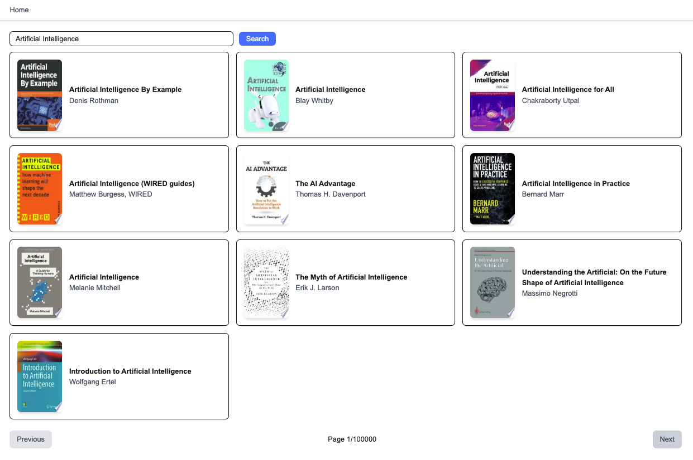
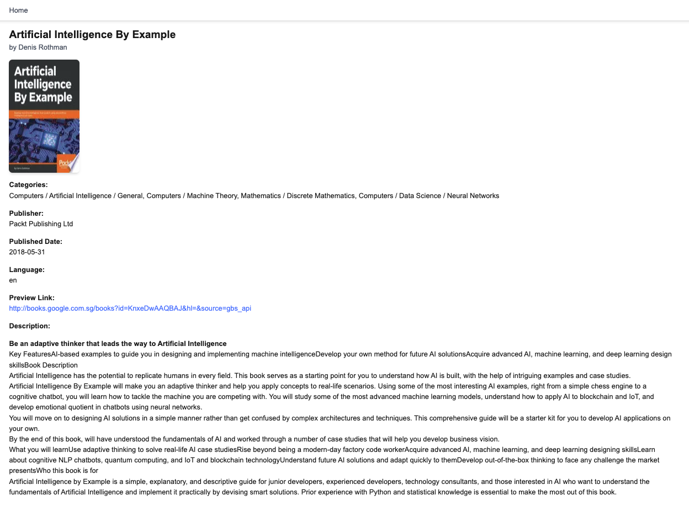

# Google Books Search

## Project Description

This is a Next.js web application that allows users to search for books using the [Google Books API](https://developers.google.com/books/docs/v1/reference/volumes). The application enables users to enter keywords in a search bar and view relevant books, with detailed information such as titles, authors, descriptions, and cover images.

## Features

- **Search Functionality:** Users can enter keywords in a search bar to find books related to the query.
- **Search Results:** Displays a list of books that match the search query with a concise view of each book's title, author(s), and cover.
- **Book Details:** Clicking on a book in the search results takes the user to a detailed page with more information about the book, including title, author(s), cover image, description, categories, publisher, and preview link.
- **Responsive UI:** The application is designed to be responsive and user-friendly across various screen sizes.

## Technologies Used

- **Next.js** with **App Router**
- **React** for the user interface
- **Google Books API** for retrieving book data
- **Tailwind CSS** for styling
- **TypeScript** for type safety

## Getting Started

### Requirements

To run this application locally, ensure you meet the following prerequisites:

- **Node.js (v20 or later)** installed on your machine. [Download Node.js](https://nodejs.org/en)
- **npm** (Node Package Manager), which comes with Node.js.
- **Git** to clone the repository. [Download Git](https://git-scm.com/)

### Installation & Setup

1. Clone this repository:

```bash
git clone git@github.com:Ley94/ai-sg-assessment.git
```

2. Navigate to the `part-2` folder in the project directory:

```bash
cd ai-sg-assessment/part-2
```

3. Install the required dependencies:

```bash
npm install
```

4. Create a `.env` file in the root of the `part-2` folder and add the following environment variable for the Google Books API:

```env
NEXT_PUBLIC_GOOGLE_BOOKS_API_BASE_URL="https://www.googleapis.com/books/v1" # Default is "https://www.googleapis.com/books/v1"
```

5. Build the application:

```bash
npm run build
```

6. Run the application locally:

```bash
npm run start
```

7. Open https://localhost:3000 in your browser to view the application.

### How to Use

1. Enter a keyword into the search bar at the top of the page.
2. Press the "Search" button to view a list of books related to the search query.
3. Click on any book to view detailed information about it.

## Screenshots & Demo Video

### Screenshots:

- Screenshot of the search page:
  

- Screenshot of a book details page:
  

### Demo Video:

- [Watch Demo Video](https://www.loom.com/share/873464dfdc4a4beba2754a26dbf6fbdd)
